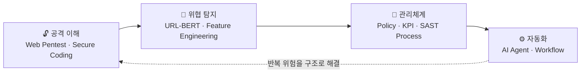
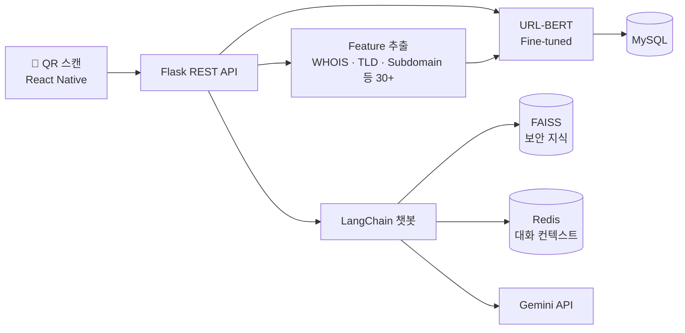

# 🛡️ 이지원 | Lee JiWon

### 보안을 기술로 해결하는 사람

정책을 이해하고, 코드를 읽고, 반복되는 위험을 **구조로** 해결합니다.

---

## 👩‍💻 About Me

덕성여자대학교 **사이버보안전공**을 졸업하고, **BMW Korea IT 부서**에서 6개월간 정보보호 실무를 경험했습니다.

- 🏢 **관리체계** — 글로벌 기업의 보안 KPI 모니터링, 정보보호 정책 문서 최신화, 소스코드 보안 점검 프로세스 운영을 지원했습니다.
- 🔓 **공격 이해** — 취약한 웹 서버를 직접 만들고 공격한 뒤, 시큐어 코딩으로 조치하며 공격자와 방어자 관점을 모두 익혔습니다.
- 🤖 **AI 탐지** — URL-BERT를 직접 구현해 큐싱(QR 피싱) URL을 **정확도 99.72%** 로 탐지하는 앱을 만들었습니다.
- ⚙️ **자동화** — 반복되는 운영 업무를 AI 에이전트(n8n)로 자동화해 사내 해커톤 **2위**를 받았습니다.

---

## 💼 Experience

### BMW Korea — IT Intern
`2026.01 ~ 2026.06` · IT 부서

| 영역 | 내용 |
| :--- | :--- |
| **정보보호 업무 지원** | 소스코드 보안 점검 프로세스 관리 · 정보보호 정책 문서 및 보안 시스템 인터페이스 명세 최신화 · 개인정보보호 솔루션 신규 버전 도입 지원 · 정보보호 컨설팅 및 이행점검 지원 |
| **클라우드·인프라 보안** | 클라우드 서버 보안 취약점 조치 · IaC 도구 기반 인프라 배포 지원 |
| **모니터링 자동화** | 모니터링 대시보드 자동 점검 프로세스 구축 · 일별 에러 로그 분석 |
| **AI 업무 자동화** | n8n 기반 통합 AI 에이전트 설계 → **사내 AI 해커톤 2위** |

> 반복 등록되는 소스코드 취약점의 원인이 **대응 가이드 부재**임을 찾아내고, 개발자용 조치 방법과 보안 담당자용 정책 근거를 함께 담은 가이드를 만들어 재등록 빈도를 줄였습니다.

---

## 📌 Featured Projects

### 🔍 [SQanaR — URL-BERT 기반 큐싱 탐지 앱](https://github.com/dlwl224/final_sqanar)
`2025.03 ~ 2025.11` · 팀 프로젝트 · **AI 모델·백엔드 담당** · 🏆 과학기술대학 학술제 **최우수상**

QR 코드에서 URL을 추출하고, AI가 실시간으로 악성 여부를 판별해 챗봇이 그 이유를 설명해 주는 앱입니다.

- 기존 모델(XGBoost 95.99%, BERT 94.03%)의 한계를 보고 **URL-BERT를 직접 구현**하여 URL과 HTTP Header 10만 건으로 파인튜닝 → **Accuracy / F1 99.72%**
- 블랙리스트에 없는 **제로데이 URL**도 URL 구조만으로 판별
- `Python` `PyTorch` `Flask` `MySQL` `Redis` `LangChain` `FAISS` `Gemini API`

### 🔓 [취약한 웹 애플리케이션 진단 및 시큐어 코딩](https://github.com/dlwl224/sc_pro)
`2025.11` · 개인 프로젝트 · 기여도 100%

| 취약점 | 공격 결과 | 조치 |
| :--- | :--- | :--- |
| SQL Injection | 로그인 인증 우회 | Prepared Statement |
| Stored XSS | 악성 스크립트 실행 | HTML Entity Encoding |
| IDOR | 타인 게시글 수정 | 세션 기반 소유권 검증 |
| File Upload | Webshell 업로드 | 확장자 화이트리스트 · 파일명 난수화 |

- Node.js/Express + MySQL로 취약 서버를 구축해 **AWS EC2**에 배포하고, Burp Suite로 공격 시나리오 검증
- Security Group 화이트리스트로 관리 포트 접근 제한
- `Node.js` `Express` `MySQL` `Burp Suite` `AWS EC2`

### 🌲 [구독숲 — OTT 구독 관리 플랫폼](https://github.com/SubscriptionForest)
`2025.07 ~ 2025.08` · 팀 프로젝트 · Full-stack
- Spring Security + **JWT 로그인**, 로그아웃 시 **토큰 블랙리스트** 처리
- `Spring Boot` `Spring Security` `JWT` `MySQL` `Android` `Firebase`

### 🧳 [뚜루 — 여행 동행 구하기 앱](https://github.com/ddu-ru) · 진행 중
`2026.01 ~` · 팀 프로젝트 · 모바일 담당
- Kotlin 기반 Android 화면 구현 및 REST API 연동
- `Kotlin` `Android` `REST API`

---

## 🏆 Awards

| 일자 | 수상 | 내용 |
| :--- | :--- | :--- |
| 2026 상반기 | 🥈 BMW Korea 사내 AI 해커톤 **2위** | 업무 통합 AI 에이전트 설계 |
| 2025.11 | 🥇 덕성여대 과학기술대학 학술제 **최우수상** | SQanaR — 큐싱 탐지 앱 |
| 2025.11 | NH농협 AI 아이디어 챌린지 **1차 예선 통과** (팀장) | 복합 AI 기반 보이스피싱 방지 시스템 |

---

## 📜 Certifications

| 자격증 | 발급 기관 | 취득 |
| :--- | :--- | :--- |
| 정보처리기사 | 한국산업인력공단 | 2025.09 |
| SQLD | 한국데이터산업진흥원 | 2025.12 |
| 리눅스마스터 2급 | 한국정보통신진흥협회 | 2025.07 |
| OPIc **IH** | ACTFL | 2026.03 |
| 新HSK 5급 | 中外语言交流合作中心 | 2025.04 |

---

## 🛠️ Tech Stack

**Security**

**Backend**

**AI**

**Infra / DB**

---

## 📚 Study & Activity

- **보안동아리 '백도어'** `2024.03 ~ 2025.01` — 제로트러스트 아키텍처·디지털 포렌식 스터디, 세미나 발표
- **솔데스크 국비교육** `2025.01 ~ 2025.08` · 1,040시간 — Spring Boot, REST API, 데이터 분석, CI/CD
- **웹해킹** — OWASP Top 10 중심 웹 취약점 분석 실습, DVWA
- **알고리즘** — [백준·프로그래머스 풀이 기록](https://github.com/dlwl224/codingtest)

---

📫 정보보호 관리체계 · 보안 진단 · 보안 자동화에 관심이 많습니다. 편하게 연락 주세요!

