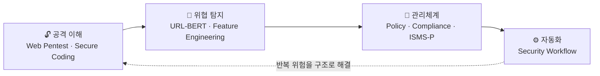
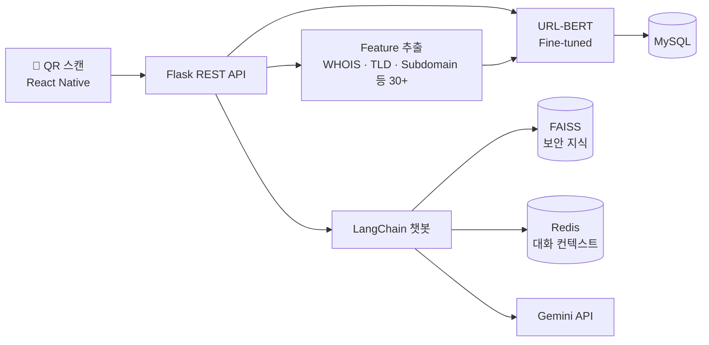

<!-- Header -->

  

  

  

---

## 🙋 About Me

**공격을 이해하고, 위협을 탐지하고, 반복되는 위험을 구조로 해결합니다.**

- 🔓 취약한 웹 서버를 직접 구축·공격하고 **시큐어 코딩으로 조치**해 본 경험
- 🤖 URL-BERT를 직접 구현해 큐싱(QR 피싱) URL을 **정확도 99.72%** 로 탐지
- 🏆 SQanaR 프로젝트로 과학기술대학 학술제 **최우수상**
- 🔍 관심 분야: **정보보호 관리체계(ISMS-P)** · 웹 취약점 진단 · AI 기반 위협 탐지 · 보안 자동화

---

## 🛠️ Tech Stack

**🔐 Security** 

**💻 Backend** 

**🤖 AI** 

**☁️ Infra & DB** 

---

## 📌 Featured Projects

<table>
<tr>
<td width="50%" valign="top">

### 🔍 [SQanaR](https://github.com/dlwl224/final_sqanar)
**URL-BERT 기반 큐싱(QR 피싱) 탐지 앱** 
`2025.03 ~ 2025.11` · 팀 · AI 모델·백엔드

- URL-BERT 직접 구현, URL+Header 10만 건 파인튜닝
- **Accuracy / F1 99.72%** (XGBoost 95.99%, BERT 94.03%)
- WHOIS·TLD·Subdomain 등 30+ Feature 파이프라인
- 블랙리스트에 없는 **제로데이 URL** 탐지
- LangChain + FAISS 보안 지식 챗봇
- 🏆 과학기술대학 학술제 **최우수상**

`PyTorch` `Flask` `LangChain` `FAISS` `Redis`

</td>
<td width="50%" valign="top">

### 🔓 [Web Pentest & Secure Coding](https://github.com/dlwl224/sc_pro)
**취약한 웹앱 구축 → 모의해킹 → 조치** 
`2025.11` · 개인 · 기여도 100%

| 취약점 | 조치 |
| :--- | :--- |
| SQL Injection | Prepared Statement |
| Stored XSS | HTML Entity Encoding |
| IDOR | 세션 기반 소유권 검증 |
| File Upload | 화이트리스트 · 파일명 난수화 |

- AWS EC2 배포, Security Group 접근 제한

`Node.js` `MySQL` `Burp Suite` `AWS EC2`

</td>
</tr>
</table>

<b>🗺️ SQanaR 시스템 구성도 보기</b>

 

### 🌲 [구독숲](https://github.com/SubscriptionForest) — 인증 보안 구현
`2025.07 ~ 2025.08` · 팀 · Full-stack
- Spring Security + **JWT** 인증, 로그아웃 시 **토큰 블랙리스트** 처리로 탈취 토큰 재사용 차단

`Spring Boot` `Spring Security` `JWT`

---

## 📜 Certifications

| 자격증 | 취득 |
| :--- | :--- |
| ✅ 정보처리기사 | 2025.09 |
| ✅ 리눅스마스터 2급 | 2025.07 |
| ✅ SQLD | 2025.12 |

---

## 📚 Security Activities

- 🛡️ **보안동아리 '백도어'** — 제로트러스트 아키텍처 · 디지털 포렌식 스터디 및 세미나 발표
- 🕸️ **웹해킹 실습** — OWASP Top 10 중심 취약점 분석, DVWA 필터링 우회 실습

---

## 📊 GitHub Stats

  
  

<!-- Footer -->

  

