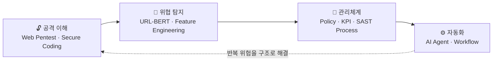
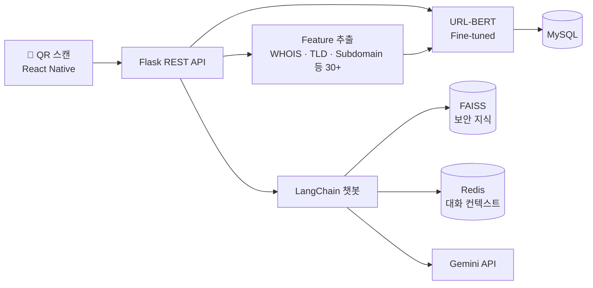

<!-- Header -->
<p align="center">
  
</p>

<p align="center">
  <a href="https://github.com/dlwl224">
    
  </a>
</p>

<p align="center">
  <a href="mailto:jw51941233@gmail.com"></a>
  <a href="https://mynote6336.tistory.com"></a>
  <a href="https://dlwl224.github.io"></a>
</p>

---

## 🙋‍♀️ About Me

<table>
<tr>
<td width="60%">

**정책을 이해하고, 코드를 읽고, 반복되는 위험을 구조로 해결합니다.**

- 🎓 덕성여자대학교 **사이버보안전공** 졸업 (2026.02)
- 🏢 **BMW Korea IT 인턴** — 정보보호 실무 6개월
- 🏆 사내 AI 해커톤 **2위** · 학술제 **최우수상**
- 🔍 관심 분야: **정보보호 관리체계(ISMS-P)** · 보안 진단 · 보안 자동화
- 🌏 Language: 한국어 · English (OPIc IH) · 中文 (HSK 5급)

</td>
<td width="40%">

```yaml
name: Lee JiWon
role: Security Engineer (Junior)
focus:
  - Security Governance
  - Web Vulnerability Assessment
  - AI-based Threat Detection
  - Security Automation
motto: "근거를 먼저 만들고 공유한다"
```

</td>
</tr>
</table>



---

## 🛠️ Tech Stack

<div align="center">

**🔐 Security**<br/>


**💻 Backend**<br/>


**🤖 AI & Automation**<br/>


**☁️ Infra & DB**<br/>


</div>

---

## 💼 Experience

### 🚗 BMW Korea — IT Intern `2026.01 ~ 2026.06`

| 영역 | 주요 업무 |
| :--- | :--- |
| 🛡️ **정보보호** | 소스코드 보안 점검 프로세스 관리 · 정보보호 정책 문서 최신화 · 개인정보보호 솔루션 도입 지원 · 이행점검 지원 |
| ☁️ **클라우드 보안** | 클라우드 서버 취약점 조치 · IaC 기반 인프라 배포 지원 |
| 📊 **모니터링** | 대시보드 자동 점검 프로세스 구축 · 일별 에러 로그 분석 |
| 🤖 **AI 자동화** | n8n 기반 통합 AI 에이전트 설계 → **사내 AI 해커톤 2위** |

> 💡 반복 등록되는 소스코드 취약점의 원인이 **대응 가이드 부재**임을 찾아, 개발자용 조치 방법과 보안 담당자용 정책 근거를 함께 담은 가이드를 만들어 재등록 빈도를 줄였습니다.

---

## 📌 Featured Projects

<table>
<tr>
<td width="50%" valign="top">

### 🔍 [SQanaR](https://github.com/dlwl224/final_sqanar)
**URL-BERT 기반 큐싱(QR 피싱) 탐지 앱**<br/>
`2025.03 ~ 2025.11` · 팀 · AI 모델·백엔드

- URL-BERT 직접 구현, URL+Header 10만 건 파인튜닝
- **Accuracy / F1 99.72%** (XGBoost 95.99%, BERT 94.03%)
- WHOIS·TLD·Subdomain 등 30+ Feature 파이프라인
- LangChain + FAISS 보안 지식 챗봇
- 🏆 과학기술대학 학술제 **최우수상**

`PyTorch` `Flask` `LangChain` `FAISS` `Redis`

</td>
<td width="50%" valign="top">

### 🔓 [Web Pentest & Secure Coding](https://github.com/dlwl224/sc_pro)
**취약한 웹앱 구축 → 모의해킹 → 조치**<br/>
`2025.11` · 개인 · 기여도 100%

- **SQLi** → Prepared Statement
- **Stored XSS** → HTML Entity Encoding
- **IDOR** → 세션 기반 소유권 검증
- **File Upload** → 화이트리스트 · 파일명 난수화
- AWS EC2 배포, Security Group 접근 제한

`Node.js` `MySQL` `Burp Suite` `AWS EC2`

</td>
</tr>
<tr>
<td width="50%" valign="top">

### 🌲 [구독숲](https://github.com/SubscriptionForest)
**OTT 구독 관리 플랫폼**<br/>
`2025.07 ~ 2025.08` · 팀 · Full-stack

- Spring Security + **JWT** 인증
- 로그아웃 시 **토큰 블랙리스트** 처리

`Spring Boot` `JWT` `Android` `Firebase`

</td>
<td width="50%" valign="top">

### 🧳 [뚜루](https://github.com/ddu-ru)
**여행 동행 구하기 앱**<br/>
`2026.01 ~ ` · 팀 · 모바일

- Kotlin 기반 Android 화면 구현
- REST API 연동, 비동기·에러 상태 처리

`Kotlin` `Android` `REST API`

</td>
</tr>
</table>

<details>
<summary><b>🗺️ SQanaR 시스템 구성도 보기</b></summary>
<br/>



</details>

---

## 🏆 Awards & 📜 Certifications

<table>
<tr>
<td width="50%" valign="top">

**🏆 Awards**

| | |
| :--- | :--- |
| 🥈 | BMW Korea 사내 AI 해커톤 **2위** (2026) |
| 🥇 | 덕성여대 과기대 학술제 **최우수상** (2025.11) |
| 🎯 | NH농협 AI 아이디어 챌린지 **1차 예선 통과** · 팀장 (2025) |

</td>
<td width="50%" valign="top">

**📜 Certifications**

| | |
| :--- | :--- |
| ✅ | 정보처리기사 (2025.09) |
| ✅ | SQLD (2025.12) |
| ✅ | 리눅스마스터 2급 (2025.07) |
| 🌏 | OPIc IH · 新HSK 5급 |

</td>
</tr>
</table>

---

## 📚 Activities

- 🛡️ **보안동아리 '백도어'** `2024.03 ~ 2025.01` — 제로트러스트 · 디지털 포렌식 스터디 및 세미나 발표
- 🎓 **솔데스크 국비교육** `2025.01 ~ 2025.08` · 1,040h — Spring Boot · REST API · CI/CD
- 🧩 **알고리즘** — [백준 · 프로그래머스 풀이 기록](https://github.com/dlwl224/codingtest)

---

## 📊 GitHub Stats

<p align="center">
  
  
</p>
<p align="center">
  
</p>

<!-- Footer -->
<p align="center">
  
</p>
